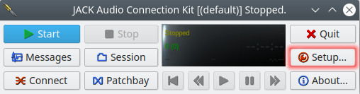
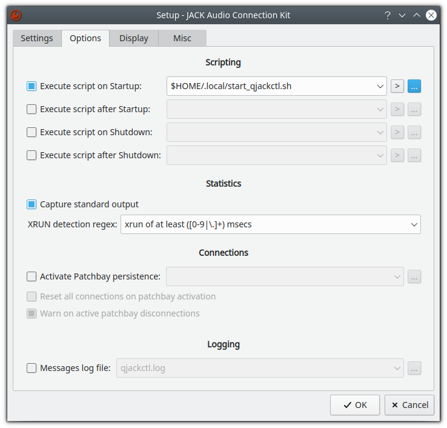
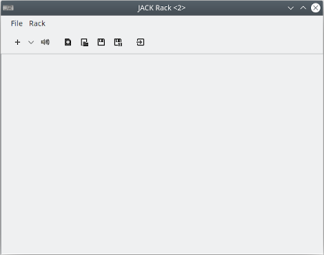
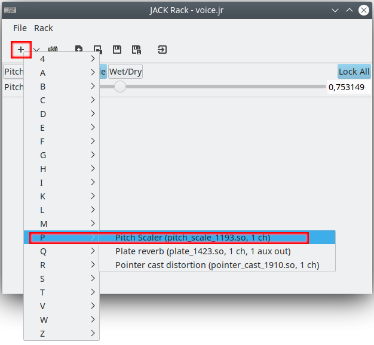

# Using Jack and PulseAudio to apply effects on your microphone voice.

_It was tested on Ubuntu 18.04 and 20.04._

One day I wanted to try out sound effects on my voice (in real time using my microphone).
But I had several problems and failed following many tutorials available on the internet.

So I tried to configure it until I was successful and now I will share with you my experience.

First, I tried to use [Sox](http://sox.sourceforge.net/), but it has a delay which did not make me happy.
So I started exploring the [Jack](https://jackaudio.org/) (_qjackctl_ and _jack-rack_) and [PulseAudio](https://www.freedesktop.org/wiki/Software/PulseAudio/) solution.

I encountered some obstacles and saw that my solution requires a few steps to always work.
The problems were:
1. Sometimes the _jackd_ daemon crashes and needs to be killed manually.
2. Jack sink and Jack Source were not selected correctly in the current pulseaudio configuration.
3. Questions about what connections to make in qjackctl.

So I wish you luck by following these steps:
#### 1. Installing some required packages and some scripts (to automate the process):
```sh
$ git clone https://github.com/jeiks/jack_and_pulseaudio.git
$ cd jack_and_pulseaudio
$ bash install.sh
# "install.sh" will install the packages "pulseaudio-module-jack qjackctl jack-rack"
# and the following scripts:
# qjackctl -> $HOME/.local/bin/qjackctl
# start_qjackctl.sh -> $HOME/.local/start_qjackctl.sh
```

#### 2. If you have old _qjackctl_'s configuration files, I recommend you to remove them:
```sh
$ rm -f $HOME/.config/jack/conf.xml $HOME/.config/rncbc.org/QjackCtl.conf
```

#### 3. Make sure the script installed above will be executed instead of _qjackctl_:
```sh
$ which qjackctl
/home/your_usename/.local/bin/qjackctl
```
Otherwise, you must add this last line in the ```~/.bashrc``` file
```sh
export PATH="$HOME/.local/bin:$PATH"
# you can insert this line using this command:
$ echo 'export PATH="$HOME/.local/bin:$PATH"' >> $HOME/.bashrc
```

#### 4. Let's configure _QJackCtl_:

Open it by the terminal:
```$ qjackctl```

And click on Setup:



First, open the Options tab, mark "Execute script on Startup:" and fill its text box with "$HOME/.local/start_qjackctl.sh":



Second, open the Misc tab and mark/unmark the checkboxes according to the image above:


Click on OK.

#### 5. On main window, click on "Quit"


#### 6. Open _QJackCtl_ and click on "Start"
```sh
$ qjackctl
```


If everything works well, the script _$HOME/.local/start_qjackctl.sh_ will be called by qjackctl and it will:
  * Load pulseaudio modules;
  * Select jack sink and source as pulseaudio default sink and source;
  * Run jack-rack;
  * Display a dialog with the connections you have to manually select on "Connections - JACK Audio Connection Kit".
  
     

#### 7. Making the JACK connections on Connections window:

Click on Connect:


  * Click on "Disconnect all"
  


  * Select "PulseAudio JACK Sink" on the left and "system" on the right and click Connect.
  * Select "system->capture_1" on the left and "jack_rack" on the right and click Connect.
  * Select "jack_rack->out_1" on the left and "PulseAudio JACK Source" on the right and click Connect.


#### 8. Using some effects:
On the _jack-rack_ you can press the plus sign and select various effects and also combine them.

Feel free to experiment and find your best effects montage.



#### 9. Testing:

Now you can open _Audacity_ or other record application and record your voice to test it.

You can also try this option, but it may generate feedback (bad noises) from your mic and the volume may be too loud:
* On Connections, you can connect "jack_rack->out_1" to "system->playback_1"

#### OK. That's all folks!! Have fun!

Note: Unfortunately, you have to create the _qjackctl_ connections every time you start it.
But you can save _jack-rack_ effects and change line 14 in ```$HOME/.local/start_qjackctl.sh``` to automatically load your effects. Example:
```sh
...
## Starting jack-rack:
if ! pidof jack-rack;then
   jack-rack PLACE_TO_EFFECT_FILE.jr &
fi
...
```
